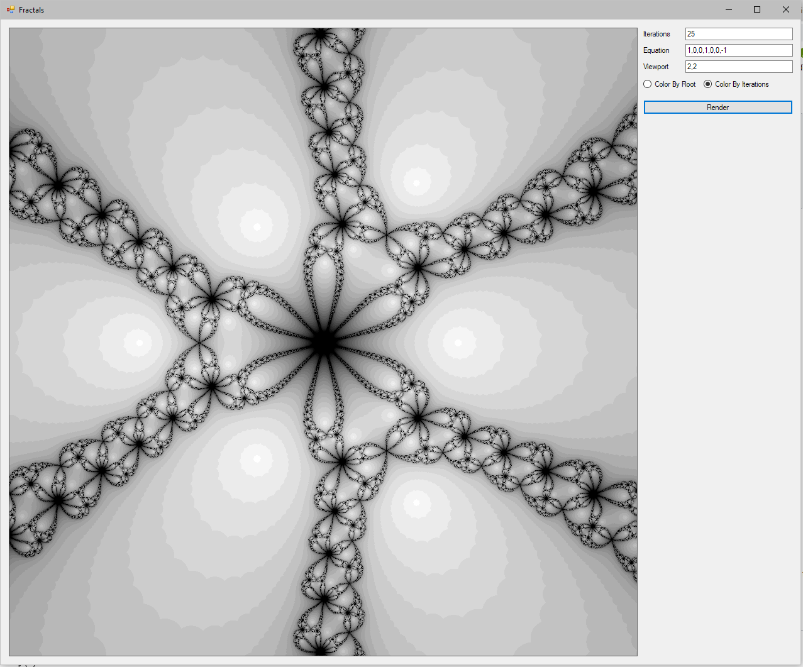
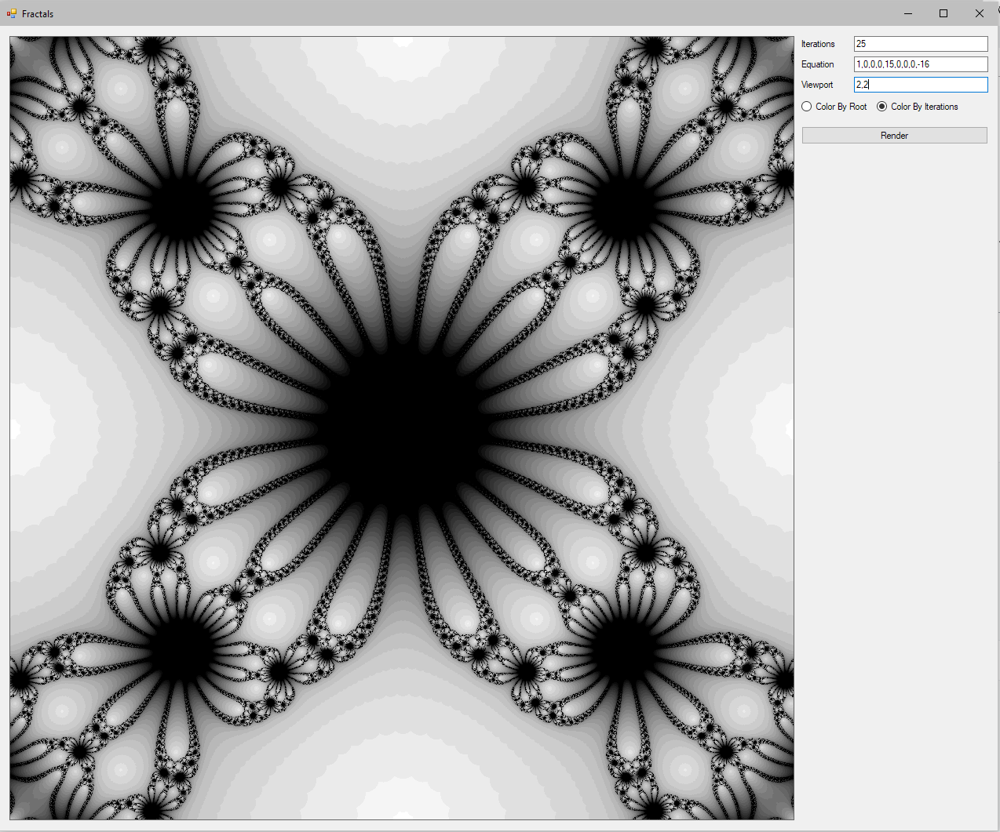

# Newton-Fractal-Generator
Generates a graphic depiction of a boundary set defined by Newton's iterative method. May take a couple of minutes to generate

In the example below, a fractal was created with the equation x^6+x^3-1, iterated 25 times, with a viewport of 1 * i. 

Likewise, the equation of this fractal is x^8+15x^4-16.

